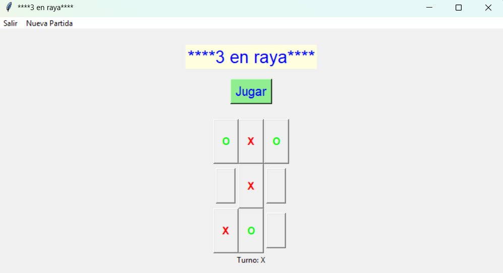

<div align="center">
  <h1>Tres en raya</h1>
  <p>El clásico juego de tres en raya para escritorio, desarrollado en Python con Tkinter.</p>
  <p><strong>Python · Tkinter · Minimax · pytest</strong></p>
</div>

---

## Acerca del proyecto

Juega una partida de tres en raya contra una inteligencia artificial. El turno inicial se decide al azar. Si empieza la IA con `O`, coloca su primera ficha en el centro y cede el turno a `X`.

La IA utiliza Minimax para evaluar las jugadas posibles. El algoritmo prioriza las victorias rápidas y, si no puede evitar perder, intenta retrasar la derrota.

## Captura



## Funcionalidades

- Interfaz gráfica de escritorio con Tkinter.
- Partidas de tres en raya en un tablero de 3 × 3.
- Turno inicial aleatorio.
- Detección de victorias horizontales, verticales y diagonales, y de empates.
- Validación de casillas ocupadas y coordenadas fuera del tablero.
- Opción para iniciar una partida nueva.
- Pruebas automatizadas con pytest.

## Requisitos

- Python 3 instalado con soporte para Tkinter.
- `pip` para instalar las dependencias de pruebas.

## Instalación y ejecución

### Windows (PowerShell)

Desde la raíz del proyecto:

```powershell
py -m venv .venv
.venv\Scripts\python.exe -m pip install -r requirements.txt
.venv\Scripts\python.exe tres_en_raya.py
```

### macOS y Linux

Desde la raíz del proyecto:

```bash
python3 -m venv .venv
.venv/bin/python -m pip install -r requirements.txt
.venv/bin/python tres_en_raya.py
```

## Pruebas

### Windows (PowerShell)

```powershell
.venv\Scripts\python.exe -m pytest -v
```

### macOS y Linux

```bash
.venv/bin/python -m pytest -v
```

## Estructura del proyecto

```text
3enRaya/
├── ia.py
├── interfaz.py
├── modelo.py
├── requirements.txt
├── test_tresArtificialEnRaya.py
├── tres_en_raya.py
├── LICENSE
└── .gitignore
```

## Tecnologías

- Python para la lógica del juego.
- Tkinter para la interfaz gráfica.
- Minimax para las jugadas de la IA.
- pytest para las pruebas automatizadas.

## Licencia

Este proyecto se distribuye bajo la licencia GNU GPL v3.0. Consulta el archivo [LICENSE](LICENSE).